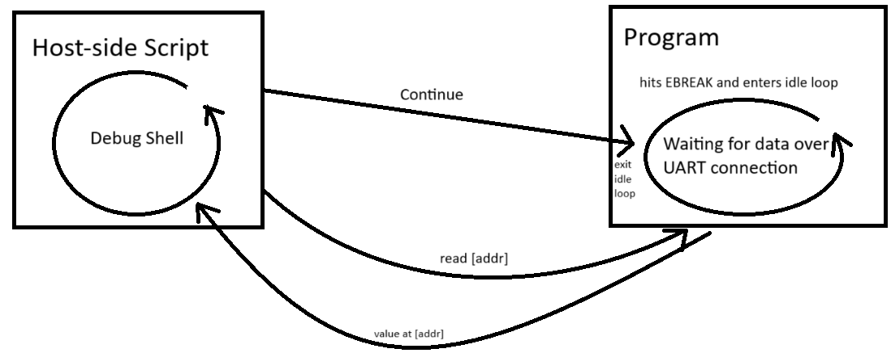
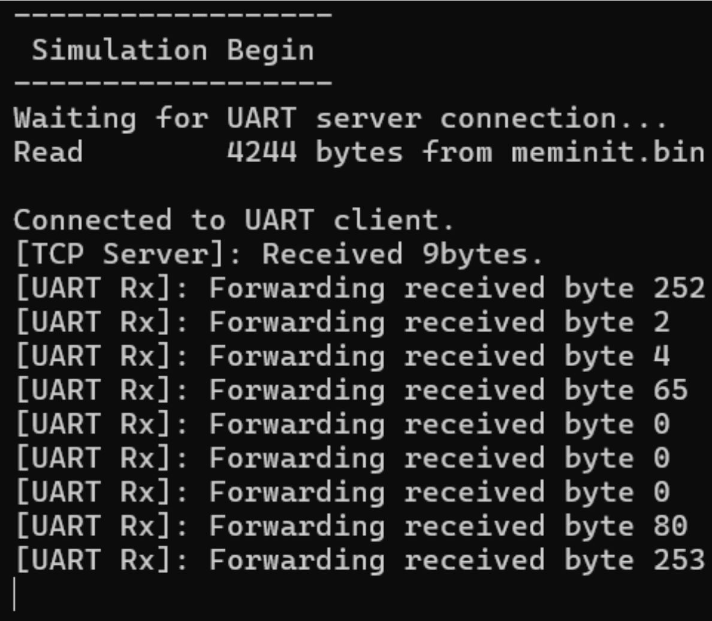

# Debugger for Boot Loader (***INCOMPLETE**)

> **IMPORTANT:** In the `w-n-c-debugging` branch ([w-n-c-debugging](https://github.com/Purdue-SoCET/AFTx07/tree/w-n-c-debugging)), not `main` branch

> As of April 27, 2024

## Overview
The boot loader of the AFTx07 previously did not have debugging capabilities. Therefore, modifications were made to be able to get real-time debugging information on an on-chip process from the host script.




## Modifications
Communication between the debugger's host-side and device-side was crucial for this. The debugger as of now takes two commands: `continue` and `read [address]`.
* `continue`: when the `enter_debugger` from `Debug.cc` receives this command from the host, it exits the idle-loop, causing the application code to continue compiling after the `ebreak` insertion.
* `read [address]`: when the `enter_debugger` from `Debug.cc` receives this command from the host, it retrieves and returns the value at `address` while staying in the idle-loop.

In `AFTx07/boot/v2/Debug.cc` ([Debug.cc](https://github.com/Purdue-SoCET/AFTx07/blob/w-n-c-debugging/boot/v2/Debug.cc)) is a file with debugging functions (notably `enter_debugger`, which sits in an idle-loop, waiting for data from UART and is called by the exception handler in the application code) which is compiled into a static library `AFTx07/boot/v2/libDebug.a` ([libDebug.a](https://github.com/Purdue-SoCET/AFTx07/blob/w-n-c-debugging/boot/v2/libDebug.a)).

> The `enter_debugger` function in `Debug.cc` of the debug library `libDebug.a`
```
extern "C" void enter_debugger() {
	BufferedUART uart(115200);
	PacketParser parser(uart);

	while (true) {
		Packet packet = parser.next_incoming();

		if (packet.valid) {
			std::string data(reinterpret_cast<const char*>(packet.data_buffer.data()), packet.data_buffer.size());

			// CONTINUE
			if (packet.code == 0x01 && packet.data_len == 8) {
				if (data == "continue") {
					Packet data = Packet::error(Protocol::ResponseCode::Message);
					data.append_data('A');
					parser.send(std::move(data));
					break;
				}
			}
			// READ [ADDR]
			else if (packet.code == 0x01 && packet.data_len == 4+4) {
				auto addr = std::stoi(data.substr(4));
				if (data.substr(0,4) == "read") {
					int *p = (int*)addr;
					Packet data = Packet::error(Protocol::ResponseCode::Message);
					data.append_data(*p);
					parser.send(std::move(data));
				}
			}
		}
	}
}
```

In the application code (i.e., the C-files in `AFTx07/sw-tests` ([sw-tests](../../sw-tests))), one has to manually add in an `ebreak` statement at a specific line and add in an `mtvec` exception handler. The `ebreak` command in the `main` function should cause the code to pause running, then enter an exception handler, which its address is specified. Afterwards, the exception handler calls the `enter_debugger` function from the debug library `libDebug.a`. To learn more about `ebreaks` and how they are used, refer to these documents:
* [The RISC-V Instruction Set Manual, Volume I: Volume I: Unprivileged ISA](https://riscv.org/wp-content/uploads/2019/12/riscv-spec-20191213.pdf) – Section 2.8 _Environment Call and Breakpoints_
* [The RISC-V Instruction Set Manual, Volume II: Privileged Architecture](https://drive.google.com/file/d/1EMip5dZlnypTk7pt4WWUKmtjUKTOkBqh/view) — Section 3 _Machine-Level ISA, Version 1.12_

> The exception handler in the application code `blink.c`
```
void __attribute__((interrupt)) handler(void) {
    uint32_t mcause;
    asm volatile("csrr %0, mcause" : "=r"(mcause));
    if ((mcause & 0x80000000) == 0 && (mcause & 0x1F) == 3) {
		//enter_debugger();
    }
}
```

> An example of where `ebreak` is placed in `blink.c`'s main function
```
int main() {
    asm volatile("csrw mtvec, %0" : : "r"(&handler)); // Set the address of the ebreak's handler
...	
    for(;;) {
        //asm volatile("ebreak");
...
```

In `AFTx07/boot/v2/host.py` ([host.py](https://github.com/Purdue-SoCET/AFTx07/blob/w-n-c-debugging/boot/v2/host.py)), the file was modified to add a `debug`-shell as well as a `debugger` function that allows for communication between the host and device.

> The `debug`-shell in the `main` function of `host.py`
```
...
        elif (words[0] == "debug"):
            if(len(words) != 1):
                print("Invalid number of arguments for debug")
                continue
            
            while (True):
                debug_command = input(f"debug>>>")
                words2 = debug_command.split()
                if (len(words2)==0):
                    continue
                    
                if (words2[0] == "continue"):
                    if (len(words2) != 1):
                        print("Invalid number of arguments for debug>>continue")
                        continue
                    else:
                        debugger(protocol, words2[0], 0)
                    
                elif (words2[0] == "read"):
                    if (len(words2) != 2):
                        print("Invalid number of arguments for debug>>read")
                        continue
                    else:
                        address = int(words2[1], base=16)
                        debugger(protocol, words2[0], address)

                elif (words2[0] == "exit"):
                    if (len(words2) != 1):
                        print("Invalid number of arguments for debug>>exit")
                        continue
                    else:
                        break
                
                else:
                    print(f"Unknown command '{command}'")
...
```
> How the `debug`-shell in the terminal should look:
```
> host.py --serial /dev/tty.usbserial-A50285BI --baud 115200
  Connecting to /dev/tty.usbserial-A50285BI at 115200 baud
>> debug
debug>>>
```

> The `debugger` function's general algorithm in `host.py`
```
...
def debugger(protocol: Protocol, command: str, address: int):
    if (command == 'continue'): # CONTINUE
        send "command" over the UART

    elif (command == 'read'): # READ
        send "read" and address over the UART

    else: # UNKNOWN COMMAND
        print(f"Unknown debug command")
...
```

## Testing
While in `AFTx07/boot/v2` , run in the terminal to generate the Debug library:
```
make
```

For the application code to test in `AFTx07/sw-tests`  (e.g., `blink.c`):  
* To call the `enter_debugger` function from the Debug library, add the following line in the beginning of the application code:
```
extern void enter_debugger();
```

* To set the address of the exception handler, add the following line in the beginning of the `main` function:
```
asm volatile("csrw mtvec, %0" : : "r"(&handler));`
```
* To use the `ebreak`, add the following line at the target breakpoint line:
```
`asm volatile("ebreak");
```
* Declare the exception handler function before the `main` function:  
```
void __attribute__((interrupt)) handler(void) {
    uint32_t mcause;
    asm volatile("csrr %0, mcause" : "=r"(mcause));
    if ((mcause & 0x80000000) == 0 && (mcause & 0x1F) == 3) {
	// Add your code here
    }
}
```

Then follow the steps in `AFTx07/doc/src/software_test.md` ([software_test.md](../../doc/src/software_test.md)) to generate the wanted `.bin`/`.elf` files.

### FPGA Testing:  
Follow `AFTx07/docs/src/fpga_test.md` ([fpga_test.md](../../doc/src/fpga_test.md)) to ensure the FPGA is ready for testing.

Once the `.bin`/`.elf` files are generated, add the file(s) to test into the same folder as the `host.py`. Then run `host.py`. Before running `host.py`, ensure that the serial port matches the port the UART is in and the baud rate is the one you want to use. For example:
```
host.py --serial /dev/tty.usbserial-A50285BI --baud 115200
```
In the terminal, enter:
```
program 0x8800 [file name].elf
```
> Make sure to program to address `0x8800` to avoid overwriting the boot loader’s RAM.

Then run:
```
enter 0x8800
```
To enter the `debug`-shell, run the following:
```
debug
```
Use either of the following commands in the shell:
> To go to the next iteration:
```
continue
```
> To read a value at `address`:
```
read [address]
```
> To exit the `debug`-shell:
```
exit
```

> If there are issues like the file not loading programming or no response from the FPGA, ensure that:
> * CTS pin on FTDI USB-to-Serial chip is grounded
> * `CPU_MHZ` in `BufferedUART.hh` is set to 25 instead of 30
> * Change `FF_RAM_SIZE` in `top_level/src/aftx07.sv` ([aftx07.sv](../../top_level/src/aftx07.sv)) to `64*K` instead of `32*K` (or alternatively change the linker that you use to build software tests to use only 16K of RAM)
> * If you're using riscv-gcc/13.2.0, include `stddef.h` in `crc.h` (alternatively build with riscv-gcc/12.2.0)
> * When building blink/pwm related tests from `AFTx07/sw-tests` ([sw-tests](../../sw-tests)) directory, run `cmake3` with `-DSYNTHESIS=1` to be able to see the LEDs blink - otherwise it will blink too fast to notice


### Simulation Testing  
To set up the simulator, follow the instructions from `AFTx07/docs/simulation.md` ([simulation.md](../../docs/src/simulation.md)). Then go to `AFTx07/top_level/tb/tb_aftx07.cc` ([tb_aftx07.cc](../../top_level/tb/tb_aftx07.cc)) and change the port to a free port.  
Go to `AFTx07/top_level/src/aftx07.sv` ([aftx07.sv](../../top_level/src/aftx07.sv)) and edit the AHB Manager line to `RESET_PC(32'00008400)`.
Copy a software test executable (`blink.bin`/`blink.elf`) into the `AFTx07/aft_out/sim*/` then rename it to `meminit.bin`  
Now, run:
```
Vaftx07 --uart
```
On the host side, run  

```
host.py --tcp --host localhost --port [PORT]
```

Enjoy debugging!

## Current Errors
Data is being sent from the host script, but the on-chip debugger doesn't seem to receive the data.




## Future Work

Get rid of hard-programming in EBREAKS and exception handlers for application code.  
Additional commands like “write [addr]” and “read [register]” for debugger
