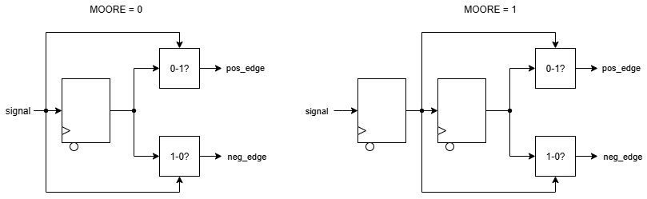
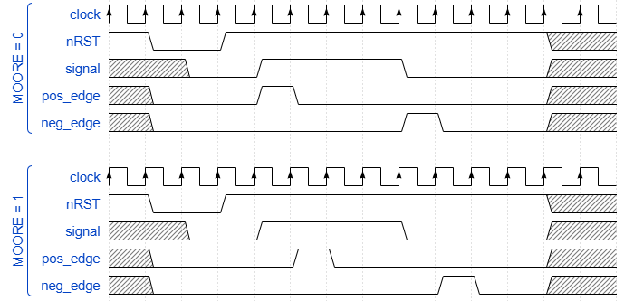

# Edge Detector
Detects 0-1 or 1-0 transitions in an input signal between two cycles combinationally and non-combinationally.

### RTL Diagram

### Sample Waveform

## I/O
| Port Name | Direction | Type | Description |
|:---------:|:---------:|:----:|:-----------|
| `CLK` | `input` | `logic` | Clock |
| `nRST` | `input` | `logic` | Active-low asynchronous reset |
| `signal` | `input` | `logic [WIDTH-1 : 0]` | Input signal to monitor for transitions |
| `pos_edge` | `output` | `logic [WIDTH-1 : 0]` | High if a 0-1 transition detected on the corresponding input signal |
| `neg_edge` | `output` | `logic [WIDTH-1 : 0]` | High if a 1-0 transition detected on the corresponding input signal |

## Function
This module detects transitions in the input signal(s) by latching their value in a DFF each cycle (two chained DFFs for Moore mode). If the Mealy machine type is selected, the current input is compared to the latched value; if they are not the same, either the corresponding `pos_edge` or `neg_edge` value is set. If the Moore machine type is selected, the last two latched values are compared instead. Note that if the Moore machine type is chosen, the output is driven by a register, and the edge detection is delayed by one clock cycle.

## Parameters
| Parameter     | Type | Description | Default Value | Valid Range |
|:---------------:|:------:|:-------------|:---------------:|:-------------:|
| `WIDTH` | `int` | Bit-width of the input signal to monitor | 1 | >= 1 |
| `RESET` | `logic` | Reset value of the signal being tracked | 0 | 0, 1 |
| `MOORE` | `logic` | Determines the Machine type. `MOORE = 0` indicates Mealy, and `MOORE = 1` indicates Moore | `0` | `0`, `1` |
