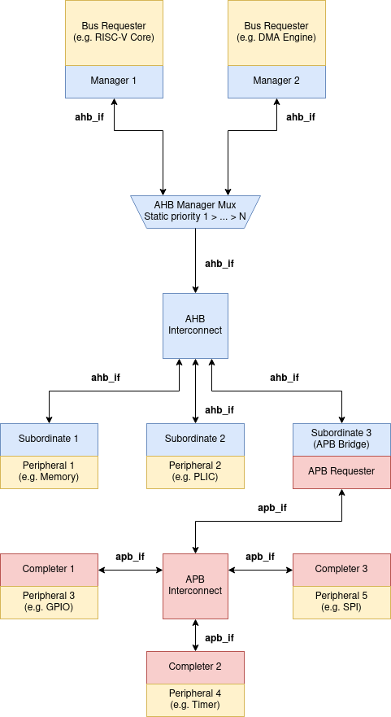

# AFTx07 Bus System

AFTx07 uses a typical AHB/APB bus system ([AMBA 5](https://www.arm.com/architecture/system-architectures/amba/amba-specifications)). It has a few deviations from the standard:
- No components currently produce more than 32b transactions, so the `HSIZE` signal is effectively ignored, and sub-word transactions are handled entirely by a combination of `HWSTRB` and requester-side interpretation of where the byte should be. In practice, this simplifies the bus system as responding components only need to mask out writes or return word-sized data without need for realignment. 
- For maximum compliance, AHB subordinates should support an `HREADYIN` signal used to synchronize the pipelined behavior between components (`HREADYIN` should sample the "global" `HREADY` being fed to the multiplexor component. This behavior is only seen when the data-phase transaction stalls). Our design does not use `HREADYIN`, and instead solves this issue by delaying generation of `HSEL` for the current address phase transaction until `HREADY` is high. This is still feedback to the AHB subordinates based on `HREADY`, but is not to-the-letter.

**These should, however, be fixed in future iterations of the chip for compatibility with off-the-shelf IP.**

## Diagram



In this diagram, AHB components are blue, APB components are red, and other components are yellow.

## Internal bus integration
Please read the Confluence page on the `bus_protocol_if`.

Note that as long as a module implements AHB/APB, it will be compatible with our system: `bus_protocol_if` and associated components are *just* tools to simplify development and reuse of IP we develop.

### AHB/APB Responding components
The AHB and APB interfacing components (Manager/Subordinate, Requester/Responder) are parameterizable units that translate between `bus_protocol_if` and the corresponding single-cycle protocol.

The AHB and APB responder components take a few parameters:
1. `BASE_ADDR`: The base address of this component. The responder component will generate offsets from this address that are given to the attached IP (e.g.: a peripheral mapped to 0x4000-0x5000 receives an AHB transaction to 0x4040; the peripheral will receive 0x40 as the access address). This facilitates re-use by allowing peripherals to operate directly on the addresses they receive, and leaving the concern of address mapping to the concrete bus protocol components.
2. `NWORDS`: The size of this component (in number of **words**, default 32b). This is used to calculate the upper bound of addresses for this component.

The other parameters are currently unfinished and should be ignored, future versions of the `bus-components` library may fill them in to allow different address or data widths to be specified.

### AHB/APB Interconnect components
The interconnect components for AHB/APB implement the decoding and multiplexing logic supported by the respective protocols. For AHB, there is also an optional manager multiplexor, to allow multiple managers to access the bus (with static priority). The interconnect components are parameterizable along the following axes:
1. `NSUBORDINATES`/`NCOMPLETERS`: The number of downstream responder components attached to this interconnect.
2. `A(H|P)B_MAP[NSUBORDINATES]`: An array of *base addresses* for each component. This is used to automatically generate the decoding/multiplexing logic. This array should be filled with the base addresses of each responding device. A request is routed to a responder `A` if `AHB_MAP[A]` <= `HADDR` < `AHB_MAP[A + 1]`. The last responder will respond to the range `AHB_MAP[NSUBORDINATES-1] - 0xFFFFFFFF`. The interconnect also implements the default response, so an error is signalled if the address falls before the first responder. Of course, there may be invalid addresses between responders. This is handled at the responder by signalling an error if the address falls outside of the half-open interval `[BASE_ADDRESS, BASE_ADDRESS + NWORDS*4)`

### AHB/APB Bridge
The bridge component is made by simply gluing together an `ahb_subordinate` and an `apb_requester` module with a `bus_protocol_if` spanning the two. That is the entire design! (Look at the code if you want to see -- it has 3 instantiations). One minor consequence of this, however, is that the APB bus looks like a "sub"-address space, in that the base addresses seen on the APB bus are offset by the AHB subordinate's `BASE_ADDRESS` (e.g. APB peripherals start at 0x80000000, the CPU puts out address 0x80000004 to interact with GPIO: `HADDR` 0x80000004 maps to `PADDR` 0x4 on the APB bus). This isn't an actual design issue, as the APB components would be performing offsetting anyways, but is somewhat confusing to look at. 

### Mapping the top chip
Bus mapping uses a few important variables on the top-level design:
- `AHB_MAP`: List of AHB subordinate base addresses
- `APB_MAP`: List of APB subordinate base addresses. IMPORTANT: These addresses are *offsets* from 0x80000000! (Bridge section)
- `*_AHB_IDX/*_APB_IDX`: Indices associated with the various responder components. These indices **must** correspond to the position in the `*_MAP` of its base address! These will be used for bus mapping. *This system is somewhat fragile, and should be improved in future tapeouts*

The top chip instantiates a few important components:
1. `managers`, `ahb_peripherals`, `apb_peripherals`: These arrays of interfaces are plugged into the interconnect components. The indices of the responding components are used to select which array member (interface) is plugged into the responding component.
2. `ahb_mux`, `ahb_simple_interconnect`, `apb_interconnect`: The concrete components implementing bus interconnect. The `ahb_mux` does an N:1 prioritization of the `managers` array. The `ahb_simple_interconnect` and `apb_interconnect` do a 1:N selection of responding components.

The modules are connected using a few macros for automatically instantiating AHB/APB responding components and linking them to a peripheral implementing `bus_protocol_if`. Look at the following from `aftx07_macros.sv`:

```sv
    `define ADD_AHB(module_name, index, nwords, bus_interface) \
        ahb_subordinate #(                      \
            .BASE_ADDR(AHB_MAP[(index)]),       \
            .NWORDS((nwords))                   \
        ) AHB_``module_name`` (                 \
            .ahb_if(ahb_peripherals[(index)]),      \
            .bus_if(bus_interface)              \
        );

```
This macro will instantiate an `ahb_subordinate` named `AHB_module_name`, where module_name is substituted for whatever is in the macro invocation (if you want to learn more, look into SystemVerilog macros). It then sets the `BASE_ADDR` and connects the correct `ahb_if` interface based on the index of the peripheral. The size of the peripheral address space is indicated by the `nwords` parameter passed into the macro. Finally, it connects the bus_interface that was passed in.

As a concrete example, we can use the PLIC. For brevity, some code is snipped out:
```sv
// --snip--
localparam int PLIC_AHB_IDX = 4;
// --snip--

localparam logic [31:0] AHB_MAP [AHB_NSUBORDINATES] = '{
    ...
    32'hA0000000, // Index is 4
    ...
};

// instantiate PLIC-related things
bus_protocol_if plic_protif();
plic_if #(.N_INTERRUPTS(15)) plicif();

plic #(.N_INTERRUPTS(15)) PLIC(
    .CLK,
    .nRST,
    .busif(plic_protif),
    .plicif
);

// Bus connected!
`ADD_AHB(plic, PLIC_AHB_IDX, 34, plic_protif);
```

Note: This system can be improved in a few ways. First, the `nwords` is not easy to maintain. Next, the manual instantiation of `bus_protocol_if` seems like it could be automated. Overall, the top-level chip should be generated somehow by an external program in future versions.

Note 2: To connect things that do not participate in `bus_protocol_if`, you can simply create an index for it, and pass the correct `ahb_peripherals`/`apb_peripherals` array member to the module (or manually connect it, if the definition of AHB/APB interface does not match ours, as in the case of open-source IP). For now, the onus is on that IP to have compatible error detection with ours, though any compliant AHB component should work. Other caveats are as above in the non-compliance section.