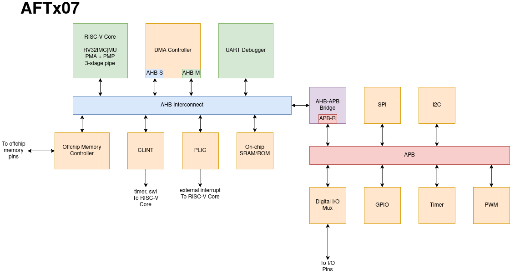

# AFTx07 Overview

## Project Goals
Create a microcontroller that can be useful for simple projects, such as those in ECE362, to demonstrate SoCET capabilities.

## Block Diagram

## Main Features
- 1x RISC-V RV32IMCZicsrZifencei Core "RISCVBusiness"
  - User ISA 20191213, Privileged ISA 1.12
  - M- and U-mode support
  - PMP support (16 regions)
  - 3-stage pipeline
  - I$/D$
  - Hardware Multiply/Divide support
- DMA (non-coherent)
- 2MB off-chip SRAM (code/data)
- CLINT & PLIC Interrupt Controllers
- Serial communication
  - SPI x1
- Peripherals
  - GPIO 1 port x 8 pins
  - Timer with 8-channel capture-compare
  - PWM x2 channels
- Configurable UART debugger
  - Debug mode - programming, memory inspection, host communication
  - User mode - UART serial communication

