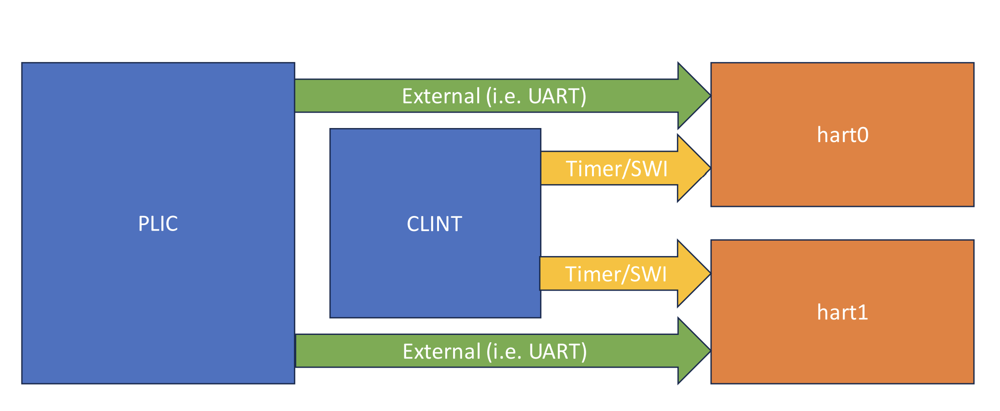

# Core Local Interruptor (CLINT)

## Overview

The core local interruptor (CLINT) is implemented as specified by the
[RISC-V Advanced Core Local Interrupt Specification](https://github.com/riscv/riscv-aclint). The core local interrupt
controller manages interrupts from two memory mapped devices: the machine-level
timer device (MTIMER) and the machine-level software interrupt device (MSWI).
An overview of the CLINT architecture can be seen below.

### MTIMER

MTIMER provides an interface to accurate time measuring counters. The `mtime`
register is a read-write register meant to be used as a real time clock. It is
writeable to allow for synchronization during startup for systems with multiple
`mtime` clocks, however, this should be unnecessary for the AFTx series of
microcontrollers. Each hart has a single `mtimecmp` (and `mtimecmph` in the
case of RV32) register used to trigger an interrupt when `mtime` is greater
than `mtimecmp`. Consult the specification for the memory map.

### MSWI

MSWI provides support for inter-processor interrupts (IPI). Each hart has
a memory-mapped `msip` register which can be used to trigger an interrupt in
another hart.

## Implementation

The CLINT sends interrupt pulses through the [CLINT interface](../../clint/src/clint_if.sv). Interrupts
are stored as an array which can be forwarded to each hart accordingly. The
global `mtime` register is also made available here to be routed to each hart.

### Parameters

- `NUM_HARTS`: number of harts the clint is is connected to. This is used to
  determine which registers in the memory map are valid to be read/writen to.
