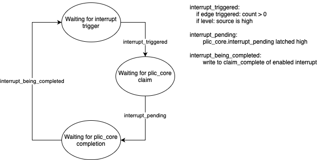

# Platform Level Interrupt Controller (PLIC)

## Overview

The Platform Level Interrupt Controller (PLIC) is implemented as specified by
the [RISC-V Platform-Level Interrupt Controller Specification](https://github.com/riscv/riscv-plic-spec). The role of the PLIC
is to marshal arbitrary interrupt signals from internal SoC sources to all
harts which can then be claimed and completed. An overview of the CLINT
architecture can be seen below.

## Implementation

### Gateway

All interrupt source are fed into a gateway which packages interrupt requests
into a common active high `interrupt_notification` signal. It is implemented as
a simple state machine as shown below. The `INTERRUPT_TRIGGER_TYPE` parameter
of type `interrupt_trigger_e` is used to determine how interrupt_notification
is triggered. The currently supported options are `RISING_EDGE`,
`FALLING_EDGE`, `ACTIVE_HIGH`, and `ACTIVE_LOW`. The edge triggered interrupt
triggers are backed by a counter. This allows the gateway to detect multiple
interrupt pulses while an interrupt is being serviced which are then serviced
after the first completes. The state machine of the gateway is shown below.

### PLIC Core

The PLIC core is the arbiter between interrupt gateways and interrupt contexts.
It handles bus reads and writes, and manages the state that gets sent to each
interrupt context. Interrupt 0 is a hardwired 0 for pending, enable, and
complete, so many of the things that usually would be of size `NUM_INTERRUPTS-1`
are of size `NUM_INTERRUPTS` to allow for easier muxing with max_priority_id as
the select line. There is also a configurable width for the priority registers,
by default it is 8 bits. The maximum priority is determined through a simple
linear scan to avoid unnecessary complexity. The memory map of the PLIC is
`0x4000000` bytes large.

### Parameters

- `NUM_CONTEXTS`: The number of contexts the PLIC supports. Can be used to
  provide multiple contexts per operation mode (i.e. m-mode and s-mode can have
  different interrupt priorities). Note that this is not the same as the number
  of harts. For more information on the meaning of "interrupt context", consult
  Chapter 1 of the [RISC-V PLIC specification](https://github.com/riscv/riscv-plic-spec/blob/master/riscv-plic.adoc#1-interrupt-targets-and-hart-contexts).
- `NUM_INTERRUPTS`: This can be used to configure the number of platform level
  interrupt sources. Note that the actual number of interrupt sources is \\(
  `NUM_INTERRUPTS` + 1 \\) due to the implied interrupt #0 which is always tied
  to 0.
- `INTERRUPT_TRIGGER_TYPES`: This is a `NUM_INTERRUPTS`-wide vector of
  `interrupt_trigger_e` where `interrupt_trigger_e` is an enum specifying
  whether the interrupt source is rising edge, falling edge, level high, or
  level low triggered. This is used to provide fine control over how interrupts
  are triggered which can be decoded into a common format. This defaults to all
  interrupts being level high triggered.
